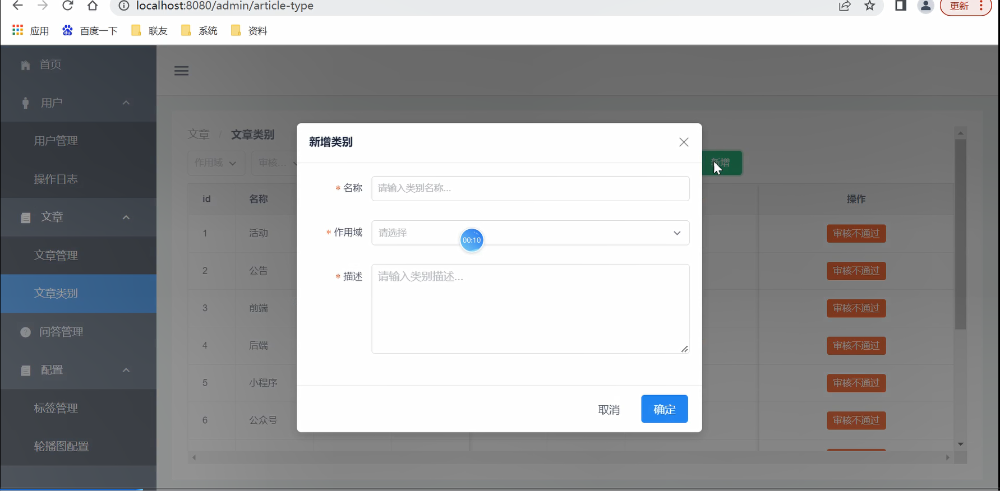
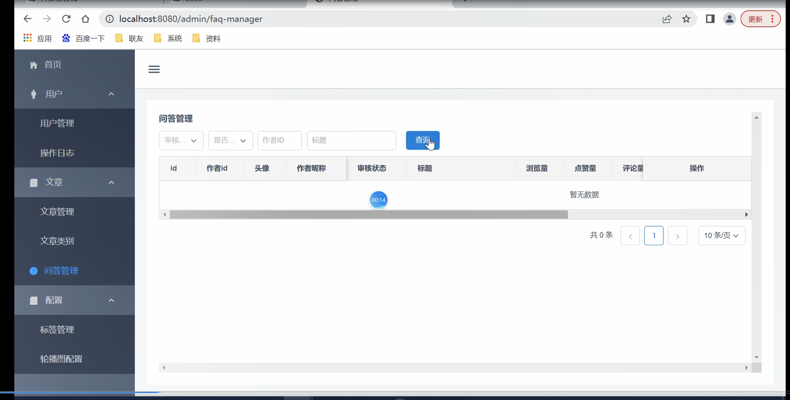

# 开源社区

#### 介绍
一款样式比较美观现代化的开源社区，功能也很全面，具备论坛的基本功能，其他功能请自行扩展
技术栈：后端基于 SpringBoot +Mybatis + MySQL，前端基于 Thymeleaf（后台管理） + Vue（前端展示）

#### 软件架构
后端架构：springboot | myabtis  
前端架构：Thymeleaf（后台管理） + Vue（前端展示）     
系统环境：jdk1.8 | maven | mysql   

#### 联系/演示地址
 [点击获取联系/演示地址](https://www.xunmaw.com/ "点击获取更多") 

 
#### 功能介绍
##### 【代码结构与数据库截图】

##### 【功能详述】 
1. 社区论坛：

2. 管理后台:  
    2.1 首页  
    

    2.2 用户管理 
     

    2.3 操作日志  
     

    2.4 文章管理  
    

    2.5 文章类别
      

    2.6 问答管理  
    

    2.7 配置管理  
    

#### 项目预览
地址：[商品详情 ](https://www.xunmaw.com/shop/detail/1622197698665725954)     
点击商品详情中的演示地址，看查看系统录制的视频    

#### 使用说明
1. 创建数据库，执行数据库脚本
2. 修改jdbc数据库连接参数
3. 下载安装maven依赖jar
4. 启动springboot项目（后端）

前端：
    cd ./forum-java-main/forum-app目录
    安装依赖: npm install  
    运行项目：npm run build

后台管理请求地址：    
    http://localhost:8080/forum/manager     
    admin    
    123456  
前端展示请求地址：    
    http://localhost:8081/forum   
    test    
    123456     

#### 联系作者
获取源码 联系微信：xunmaw001
